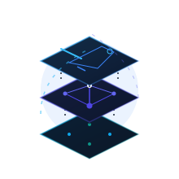
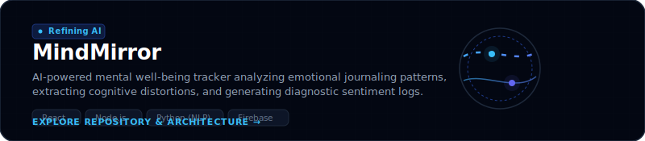
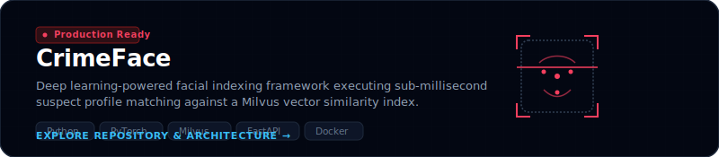
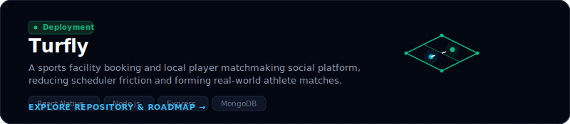
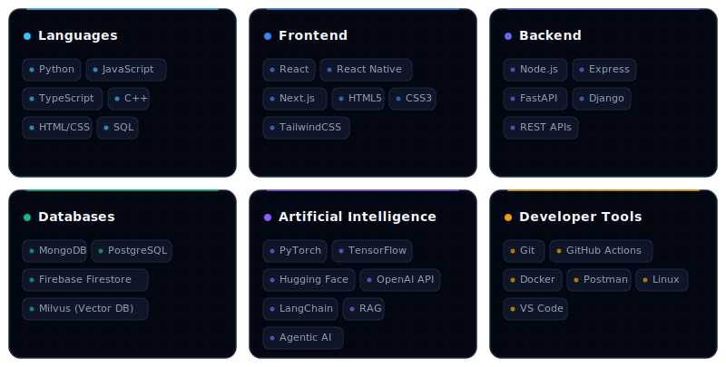
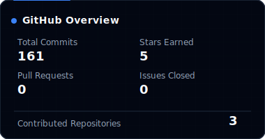
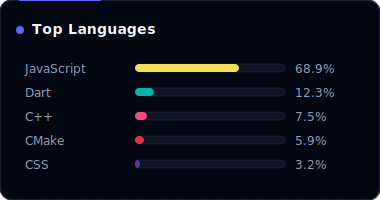
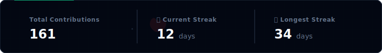
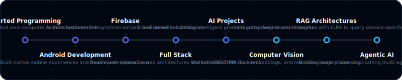

<!-- AUTOMATED FILE - DO NOT EDIT DIRECTLY. EDIT templates/README.template.md AND RUN scripts/update_readme.js -->

  
  <!-- HERO BANNER -->
  

    

  <!-- SOCIALS & QUICK CONTACTS -->
  
  
  
  
  

 

<!-- WAVE SEPARATOR -->

## 👤 ABOUT ME

<table width="100%" border="0" cellpadding="10" cellspacing="0">
  <tr>
    <td width="65%" valign="top" style="border: none;">
      

        <strong>I approach software engineering with a product-first, builder's mindset.</strong> my passion lies at the intersection of AI Engineering, Computer Vision, and Full Stack development. I design and build high-throughput, low-latency intelligence pipelines, and wrap them in elegant, production-grade applications.
      

      

        Whether it is engineering real-time facial recognition search engines that scale across millions of vectors, or architecting sentiment intelligence platforms, I focus on shipping software that solves real-world human needs. My long-term goal is to build impactful products that scale from MVP to market disruptor.
      

    </td>
    <td width="35%" valign="top" align="center" style="border: none;">
      
    </td>
  </tr>
</table>

 

<!-- SLOPE SEPARATOR -->

## 🚀 CURRENT MISSION

<table width="100%" border="0" cellpadding="10" cellspacing="0">
  <tr style="border: none;">
    <th width="50%" align="left" style="border: none; border-bottom: 2px solid #1e293b; padding-bottom: 10px;">
      ⚡ Currently Building
    </th>
    <th width="50%" align="left" style="border: none; border-bottom: 2px solid #1e293b; padding-bottom: 10px;">
      📚 Deepening Knowledge
    </th>
  </tr>
  <tr style="border: none;">
    <td valign="top" style="border: none;">
      <ul>
        <li><strong>MindMirror</strong>: AI-powered mental health journaling & cognitive distortion extraction.</li>
        <li><strong>CrimeFace</strong>: Advanced real-time facial recognition search connected to Milvus vector indexes.</li>
        <li><strong>Turfly</strong>: A unified sports booking engine and local player matching social network.</li>
      </ul>
    </td>
    <td valign="top" style="border: none;">
      <ul>
        <li><strong>Agentic AI</strong>: Multi-agent state orchestration, tool calling and reasoning graphs.</li>
        <li><strong>RAG Architectures</strong>: Semantic chunking, hybrid keyword/vector search, and reranking pipelines.</li>
        <li><strong>System Design</strong>: High-concurrency API gateways, caching layers, and distributed architectures.</li>
        <li><strong>Open Source</strong>: Contributing to mainstream AI developer toolkits.</li>
      </ul>
    </td>
  </tr>
</table>

 

<!-- WAVE SEPARATOR -->

## 🛠️ FEATURED PRODUCTS

Each project reflects a journey of solving a unique problem using specialized technologies. Click on the cards to explore the repositories.

<table width="100%" border="0" cellpadding="5" cellspacing="0">
  <!-- PROJECT 1: MINDMIRROR -->
  <tr>
    <td style="border: none; padding-bottom: 20px;">
      
      

        
<b>🔍 Technical Deep-Dive: MindMirror</b> (Click to expand)

         
        <blockquote>
          <b>The Problem:</b> Mental well-being diaries are tedious to maintain, and users rarely notice emotional trends or harmful cognitive distortion patterns without professional analysis. 
          <b>The Solution:</b> An intelligent journaling platform that uses NLP to extract semantic sentiment, logs psychological distortions (e.g., catastrophizing), and generates visual dashboard summaries of mental health health state. 
          <b>Tech Stack:</b> React, Node.js, Python (NLTK/Transformers), Tailwind CSS, Firebase Firestore. 
          <b>Current Status:</b> Active refinement. Planning to integrate voice-based journaling with multi-modal tone analysis.
        </blockquote>
      

    </td>
  </tr>
  
  <!-- PROJECT 2: CRIMEFACE -->
  <tr>
    <td style="border: none; padding-bottom: 20px;">
      
      

        
<b>🔍 Technical Deep-Dive: CrimeFace</b> (Click to expand)

         
        <blockquote>
          <b>The Problem:</b> Video surveillance identification is manual and extremely slow when cross-referencing multi-million record criminal suspect files. 
          <b>The Solution:</b> A low-latency, deep learning-powered facial identification pipeline. Converts CCTV face feeds to high-dimensional embeddings and executes sub-millisecond vector similarity search against a Milvus index. 
          <b>Tech Stack:</b> Python, OpenCV, PyTorch, FastAPI, Milvus, Docker. 
          <b>Current Status:</b> Production-ready. Currently improving occlusion robustness and multi-camera person re-identification.
        </blockquote>
      

    </td>
  </tr>

  <!-- PROJECT 3: TURFLY -->
  <tr>
    <td style="border: none; padding-bottom: 20px;">
      
      

        
<b>🔍 Technical Deep-Dive: Turfly</b> (Click to expand)

         
        <blockquote>
          <b>The Problem:</b> Sports enthusiasts experience friction booking turf courts and assembling enough local players to form matches. 
          <b>The Solution:</b> A mobile booking platform that integrates real-time scheduling APIs with a social matchmaking engine where players can host or join public matches. 
          <b>Tech Stack:</b> React Native, Node.js, Express, MongoDB, Google Maps API. 
          <b>Current Status:</b> Deployment phase. Moving to integrate league tournament brackets and group split-payment gateways.
        </blockquote>
      

    </td>
  </tr>
</table>

 

<!-- SLOPE SEPARATOR -->

## 💻 TECH STACK

  

 

<!-- WAVE SEPARATOR -->

## 📊 GITHUB ANALYTICS

  
  <!-- DYNAMIC DASHBOARD INJECTED HERE -->
  <!-- START_SECTION:github_stats -->
  <table width="100%" border="0" cellpadding="5" cellspacing="0">
    <tr>
      <td width="50%" align="center" valign="top" style="border: none;">
        
      </td>
      <td width="50%" align="center" valign="top" style="border: none;">
        
      </td>
    </tr>
    <tr>
      <td colspan="2" align="center" valign="top" style="border: none; padding-top: 15px;">
        
      </td>
    </tr>
  </table>
  <!-- END_SECTION:github_stats -->

 

### 🐍 CONTRIBUTION HISTORY

  <!-- START_SECTION:contribution_snake -->
  
  <!-- END_SECTION:contribution_snake -->

 

<!-- SLOPE SEPARATOR -->

## 🗺️ LEARNING JOURNEY

  

 

<!-- WAVE SEPARATOR -->

## 🎯 DEVELOPER PHILOSOPHY & ROADMAP GOALS

<table width="100%" border="0" cellpadding="10" cellspacing="0">
  <tr>
    <td width="50%" valign="top" style="border: none; border-right: 1px solid #1e293b;">
      <h3 align="center">💡 Engineering Philosophy</h3>
      

        <strong>1. Build with Purpose:</strong> Coding is a superpower. Every line of code should be aimed at solving a specific friction point or creating concrete utility.
      

      

        <strong>2. Strive for Simplicity:</strong> Simple architectures scale better, are easier to debug, and survive user growth. Over-engineering is a debt paid in production.
      

      

        <strong>3. Stay Adaptable:</strong> The AI field changes weekly. A great engineer is not defined by their current stack, but by their speed of adapting to new paradigms.
      

    </td>
    <td width="50%" valign="top" style="border: none;">
      <h3 align="center">🎯 Future Milestones</h3>
      <ul>
        <li><b>Open Source:</b> Commit feature integrations to LlamaIndex/LangChain/AutoGen core libraries.</li>
        <li><b>Vector DB Architectures:</b> Implement raw C++ extensions for custom distance metrics in vector search.</li>
        <li><b>Micro-SaaS Incubator:</b> Ship, launch, and validate two AI products to 500+ active users.</li>
        <li><b>Mentorship & Sharing:</b> Write in-depth articles detailing RAG optimization and agentic behaviors.</li>
      </ul>
    </td>
  </tr>
</table>

 

<!-- SLOPE SEPARATOR -->

## 📁 DYNAMIC WORKPLACE ACTIVITY

Here are the repositories I've been actively developing lately:

<!-- START_SECTION:latest_repos -->
<table width="100%" border="0" cellpadding="8" cellspacing="0">
  <tr style="border: none;">
    <td width="50%" valign="top" style="border: none; padding-bottom: 15px;">
      

        <h4 style="margin: 0 0 8px 0; font-family: 'Outfit', sans-serif;">
          <a href="https://github.com/soham-arch/newfeel" target="_blank" style="color: #38bdf8; text-decoration: none; font-weight: 700;">📂 newfeel</a>
        </h4>
        

          No description provided.
        

        

          ⭐ 0
          🍴 0
          ● JavaScript
        

      

    </td>
    <td width="50%" valign="top" style="border: none; padding-bottom: 15px;">
      

        <h4 style="margin: 0 0 8px 0; font-family: 'Outfit', sans-serif;">
          <a href="https://github.com/soham-arch/Mindmirror-backend" target="_blank" style="color: #38bdf8; text-decoration: none; font-weight: 700;">📂 Mindmirror-backend</a>
        </h4>
        

          No description provided.
        

        

          ⭐ 0
          🍴 0
          ● JavaScript
        

      

    </td>
  </tr>
  <tr style="border: none;">
    <td width="50%" valign="top" style="border: none; padding-bottom: 15px;">
      

        <h4 style="margin: 0 0 8px 0; font-family: 'Outfit', sans-serif;">
          <a href="https://github.com/soham-arch/SHMS-Helical-Spring-Optimization" target="_blank" style="color: #38bdf8; text-decoration: none; font-weight: 700;">📂 SHMS-Helical-Spring-Optimization</a>
        </h4>
        

          No description provided.
        

        

          ⭐ 0
          🍴 1
          ● Code
        

      

    </td>
    <td width="50%" valign="top" style="border: none; padding-bottom: 15px;">
      

        <h4 style="margin: 0 0 8px 0; font-family: 'Outfit', sans-serif;">
          <a href="https://github.com/soham-arch/Smart-City-Management" target="_blank" style="color: #38bdf8; text-decoration: none; font-weight: 700;">📂 Smart-City-Management</a>
        </h4>
        

          No description provided.
        

        

          ⭐ 0
          🍴 0
          ● JavaScript
        

      

    </td>
  </tr>
</table>
<!-- END_SECTION:latest_repos -->

 

  
  ## 🔗 GET IN TOUCH
  
  <table border="0" cellpadding="10" cellspacing="0">
    <tr style="border: none;">
      <td style="border: none;">
        
      </td>
      <td style="border: none;">
        
      </td>
      <td style="border: none;">
        
      </td>
    </tr>
    <tr style="border: none;">
      <td style="border: none;">
        
      </td>
      <td style="border: none;">
        
      </td>
      <td style="border: none;">
        
      </td>
    </tr>
  </table>

   

  

  <!-- FOOTER -->
  
    Designed with a Darkest GitHub Blue system by Soham Patil. 
    🤖 Profile engine compiled automatically. Last update: <!-- START_SECTION:update_date -->2026-07-18<!-- END_SECTION:update_date -->.
  

